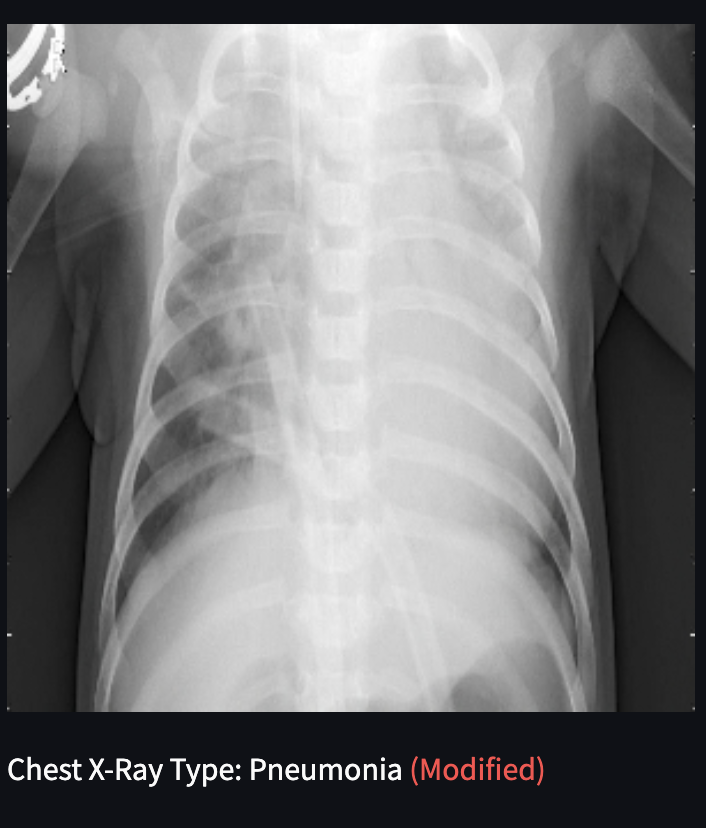
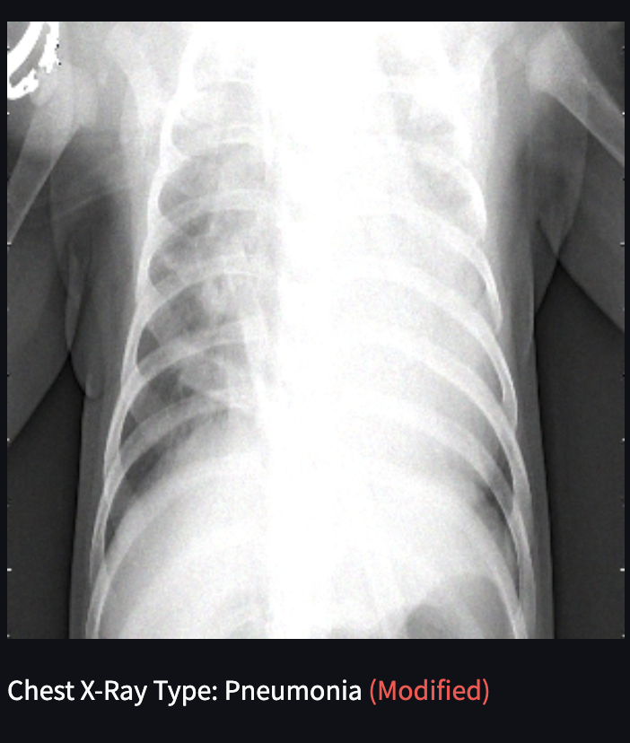

# pneumonia-xray-bayesian-detector

Repository for streamlit hosted web app that will host a bayesian convolutional neural network trained to find pneumonia in chest xrays using Tensorflow-probability. This app hosts all 624 images in the test dataset, as well as the latest trained model parameters.

This app contains a number of options in the sidebar that modify test images: 

* Horizontal / Vertical image flips
* Direct modification of image contrast
* Direct modification of image brightness

There are also sliders and a dropdown list to select different types of image noise to add to the image before performing classification. The five images below illustrate the unmodified and noise-added images.

|:-:|:-:|:-:|:-:|:-:|
|||||

<!-- 
| <a style="color:green"><b>True Negative</b></a>  | <a style="color:red"><b>False Positive</b></a> |
|||
| <a style="color:red"><b>False Negative</b></a> | <a style="color:green"><b>True Positive</b></a>  |
|||

 -->